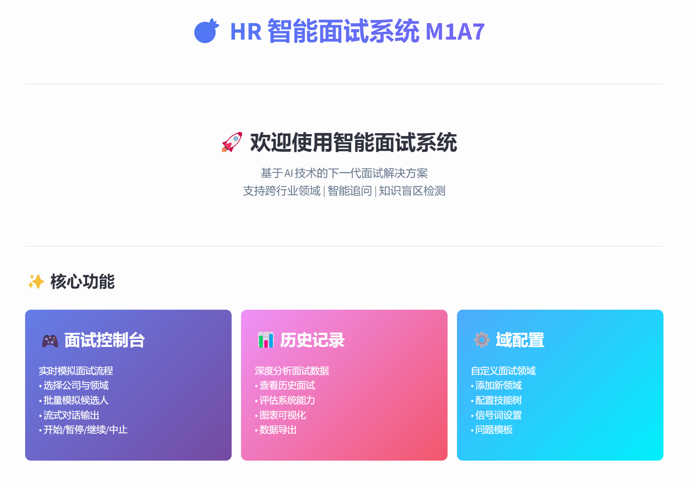
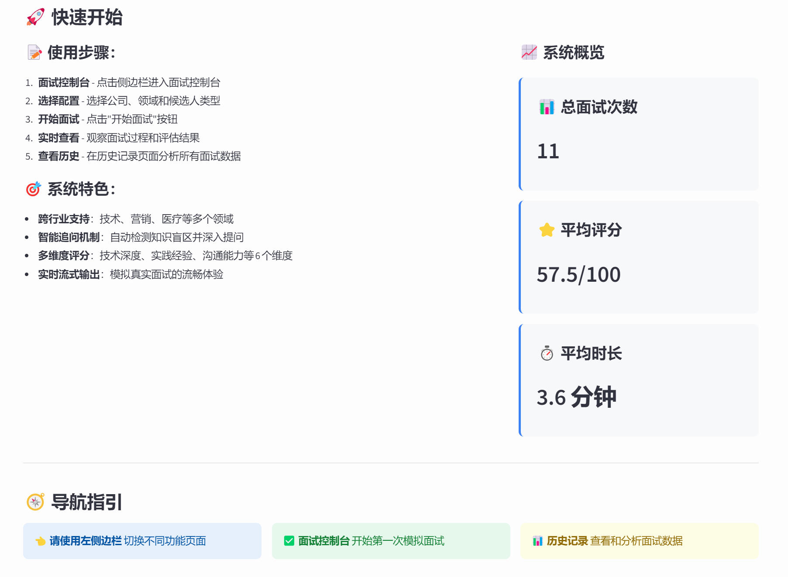
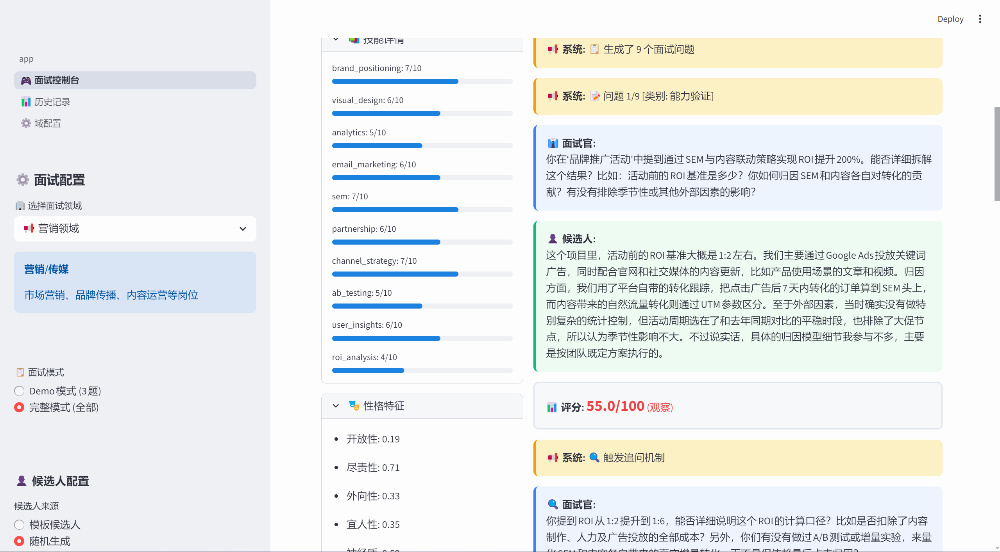
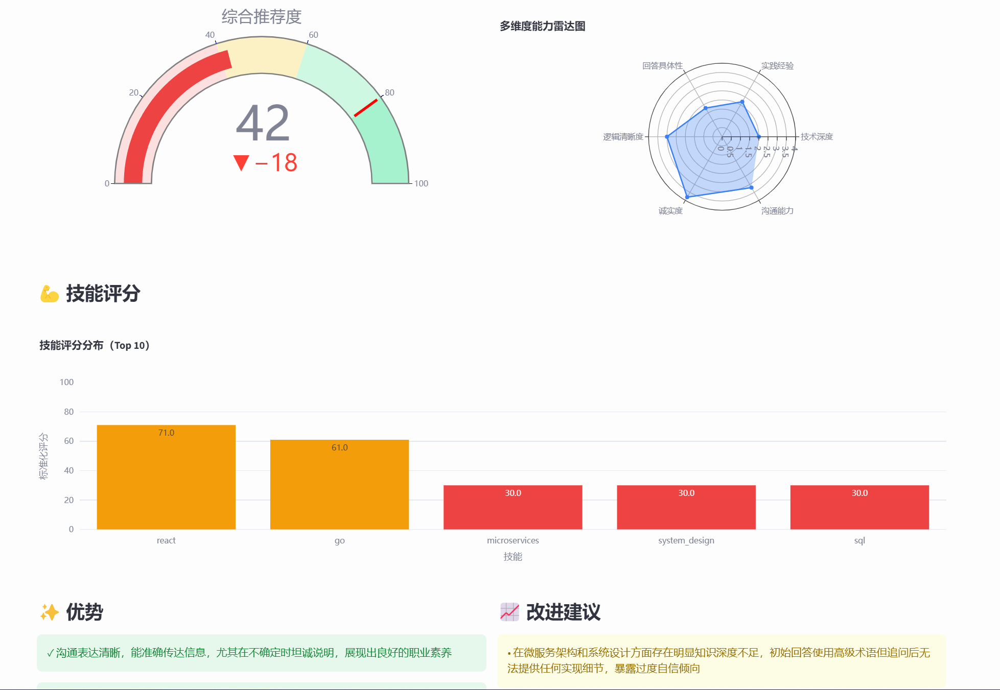
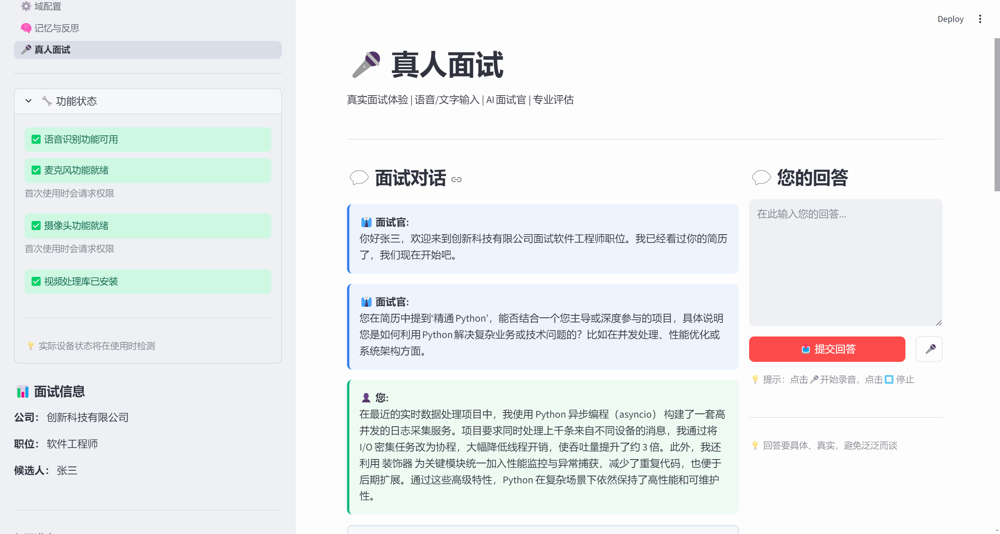
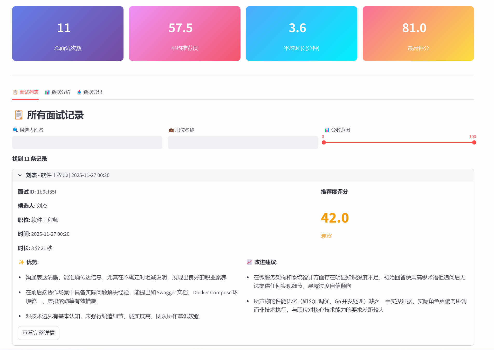
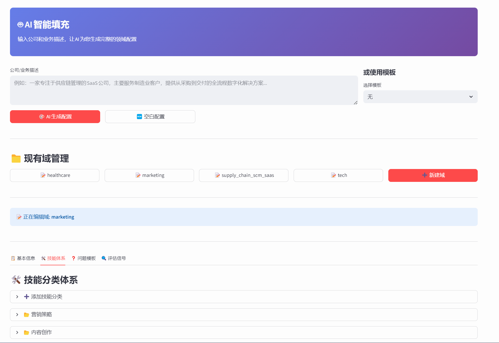
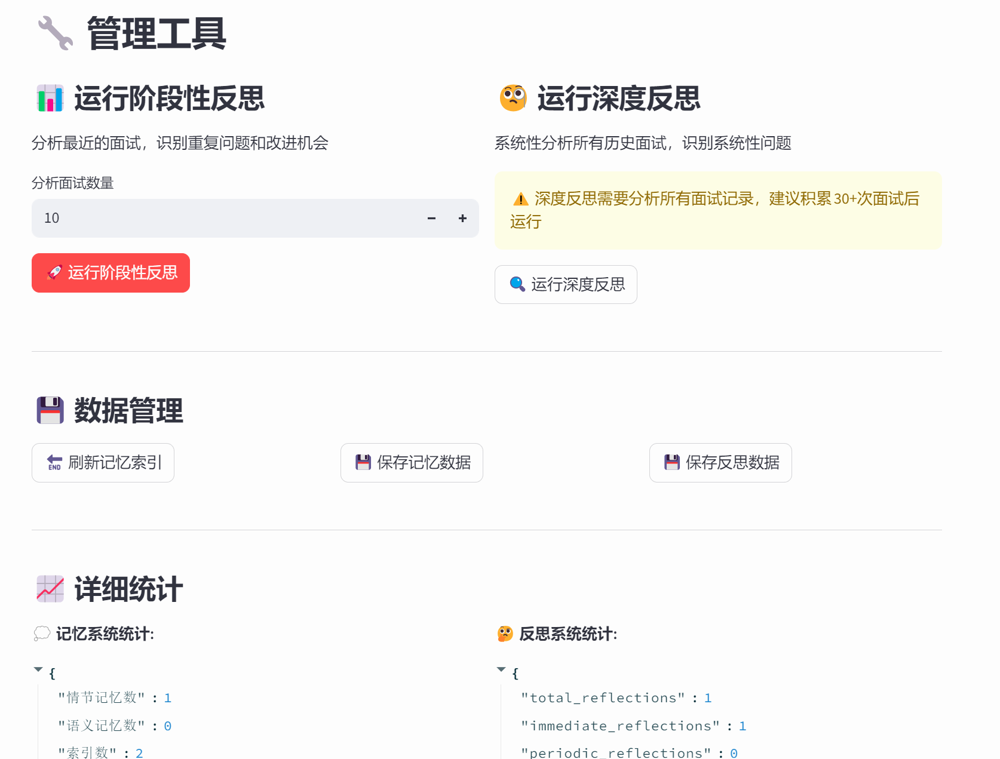
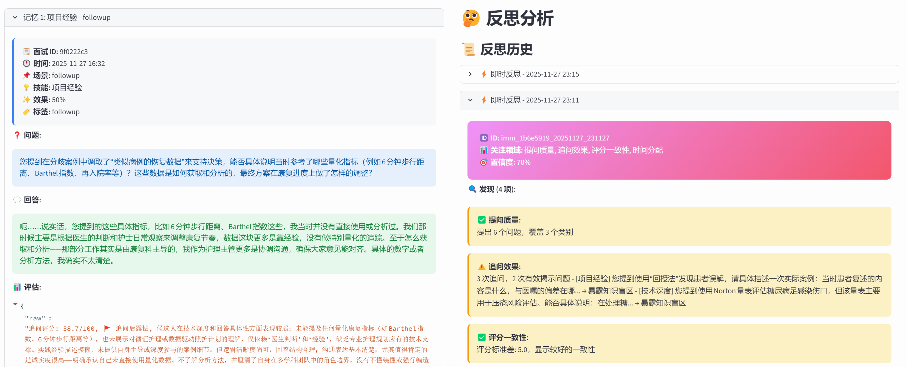

# 智能面试系统 (Dual-Agent Interview System)

> 🤖 基于LLM的双Agent自动面试模拟系统 | 支持跨行业领域 | 知识盲区检测 | 智能追问机制

[](https://www.python.org/downloads/)
[](LICENSE)
[](https://github.com)

## 📌 项目简介

本系统采用**双Agent架构**，通过面试官Agent和候选人Agent的智能交互，实现完全自动化的面试流程。系统具备跨行业领域支持、知识盲区检测、智能追问等高级特性，可用于面试系统研究、人才评估模型训练等场景。

### 🎯 核心特点

- ✅ **双Agent架构**：面试官Agent + 候选人Agent 完全自动化对话
- ✅ **真人面试模式** 🆕：支持真人替换AI候选人，智能面试官辅助评估
- ✅ **语音识别输入** 🆕：支持手动录音识别，混合文字和语音输入
- ✅ **视频分析接口** 🆕：预留测谎模型和大五人格识别模型接口（详见Phase 12）
- ✅ **跨行业支持**：内置tech/marketing/healthcare/supply_chain_scm_saaS四大领域，可扩展至任意行业
- ✅ **知识盲区机制**：模拟候选人的知识误判（过度自信/过度谦虚）
- ✅ **智能追问系统**：检测浅层回答，自动深入追问验证真实能力
- ✅ **Few-Shot Negative Examples**：通过负面示例防止候选人"圆场"
- ✅ **智能简历生成**：候选人自动生成个性化简历，可能存在夸大或过度谦虚
- ✅ **基于简历提问**：面试官分析简历识别兴趣点，针对性提问验证能力
- ✅ **随机性格生成**：支持4种策略（纯随机/原型/混合/极端）+ 6种原型
- ✅ **多维度评分**：0-100标准化评分，支持深度/完整性/准确性等多个维度
- ✅ **记忆与反思系统**：三层记忆架构+三级反思机制，持续学习和自我改进
- ✅ **可配置性强**：技能水平、性格特质、经验背景均可灵活配置

### 💡 应用场景

| 场景 | 说明 | 价值 |
|------|------|------|
| **真人面试辅助** 🆕 | 真人候选人+AI面试官，智能评估和追问 | 实际招聘场景应用 |
| **面试系统评估** | 测试面试官Agent的提问质量和评估准确性 | 验证面试流程有效性 |
| **训练数据生成** | 自动生成大量高质量面试对话数据 | 用于模型训练和研究 |
| **候选人模拟** | 模拟各类候选人特质（紧张、过度自信等） | 研究不同特质对面试的影响 |
| **简历真实性分析** | 对比简历描述与实际表现，检测夸大 | 研究简历可信度评估 |
| **招聘流程优化** | 测试不同面试策略的效果 | 优化招聘决策流程 |
| **跨行业研究** | 支持技术、营销、医疗、供应链等多个领域 | 领域适应性研究 |

---

## 🖼️ 系统界面展示

### 首页界面


### 快速开始和总览


### 面试过程细节展示


### 面试结果详解


### 真人面试界面


### 面试历史记录


### 领域配置界面


### 记忆与反思管理


### 记忆与反思详情


---

### ⭐ 功能亮点

#### 1. 知识盲区系统
- **过度自信**：actual_level < perceived_level，会"不懂装懂"
- **过度谦虚**：actual_level > perceived_level，明明会却说不确定
- **自知之明**：影响候选人对自身能力的认知准确度

#### 2. 智能追问机制
- 自动检测浮于表面的回答（使用高级术语但缺乏细节）
- 基于领域配置的信号词汇检测（高级术语、模糊词汇、露怯关键词）
- 动态生成深入追问，验证候选人的真实能力水平

#### 3. Few-Shot Negative Examples
- 在追问时注入负面示例，明确展示"错误回答"和"正确回答"
- 防止候选人通过"圆场"掩盖知识不足
- 迫使候选人诚实承认不懂，真实反映能力水平

#### 4. 智能简历生成系统 🆕
- 根据候选人能力、性格和知识盲区自动生成个性化简历
- 简历可能**夸大**过度自信领域，**低调描述**过度谦虚领域
- 性格特质影响简历风格（外向性、尽责性等）
- 面试官分析简历识别兴趣点，生成2-3个针对性问题
- 简历数据保存至`data/resumes/`目录

#### 5. 跨行业领域支持
- **tech**：技术/互联网（33个技能），覆盖backend/frontend/database/architecture/devops等
- **marketing**：营销/传媒（28个技能），覆盖策略/内容/数字营销/渠道管理等
- **healthcare**：医疗/护理（29个技能），覆盖临床/专科/管理/患者照护等
- **supply_chain_scm_saaS**：供应链管理SaaS/制造业（40个技能），覆盖采购/物流/库存/生产排程等
- 支持自定义添加新领域，无需修改代码

#### 6. Agent记忆与反思系统 🆕
- **三层记忆架构**：短期记忆（当前会话）、情节记忆（历史片段）、语义记忆（通用规律）
- **三级反思机制**：即时反思（每次面试后）、阶段性反思（10-20次）、深度反思（系统性分析）
- **持续学习能力**：从历史面试中学习经验，智能检索相关案例辅助决策
- **自动改进建议**：识别提问质量、追问效果、评分一致性等问题，生成优化方案
- **效果追踪记录**：保存改进历史和效果评估，支持数据驱动的系统优化

#### 7. 真人面试系统 🆕
- **混合输入模式**：支持文字输入、语音识别，可灵活切换和组合
- **手动录音控制**：点击🎤开始录音，说话完毕后停顿，点击⏹️停止并识别
- **语音转文字**：基于Google API的高质量语音识别，支持中英文
- **视频录制**：实时录制面试过程，保存至`data/videos/`目录
- **模型接口预留**：为测谎模型和大五人格识别模型预留完整回调接口
  - **测谎检测**：分析微表情、压力指标，判断回答真实性
  - **人格识别**：评估开放性、尽责性、外向性、宜人性、神经质五大特质
- **即插即用设计**：接口标准化，可快速对接任何计算机视觉模型

---

## 🏗️ 项目结构

```
HRM1/
├── agents/                            # 🤖 Agent模块
│   ├── __init__.py
│   ├── candidate_agent.py             # 候选人Agent（支持知识盲区、性格特质）
│   ├── interviewer_agent.py           # 面试官Agent（多维评分、追问机制）
│   └── prompts/                       # Prompt模板
│       ├── __init__.py
│       ├── candidate_prompts.py       # 候选人系统提示词（含Few-Shot Negative Examples）
│       ├── interviewer_prompts.py     # 面试官系统提示词
│       └── resume_prompts.py          # 简历生成提示词 🆕
│
├── config/                            # ⚙️ 配置文件
│   ├── __init__.py                    # 配置加载器
│   ├── candidate_templates/           # 候选人模板库
│   │   ├── ideal_candidate.json       # 理想候选人
│   │   ├── junior_candidate.json      # 初级候选人
│   │   ├── nervous_candidate.json     # 紧张型候选人
│   │   ├── overconfident_candidate.json  # 过度自信候选人
│   │   ├── underconfident_candidate.json # 不自信候选人
│   │   └── test_react_blind_spot.json    # React知识盲区测试模板
│   ├── companies_template/            # 公司信息配置模板
│   │   └── tech_startup.json          # 科技创业公司
│   └── jobs_template/                 # 职位需求配置模板
│       └── senior_backend.json        # 高级后端工程师
│
├── core/                              # 🎯 核心引擎
│   ├── __init__.py
│   ├── audio_video_tools.py           # 音视频工具（语音识别+视频录制）🆕
│   ├── batch_runner.py                # 批量面试执行器
│   ├── evaluation.py                  # 评估模块（已弃用，由LLM直接评分）
│   ├── interview_engine.py            # 面试引擎（协调Agent交互）
│   ├── llm_client.py                  # LLM客户端（封装API调用）
│   ├── memory_system.py               # 记忆系统（三层记忆架构）
│   ├── reflection_system.py           # 反思系统（三级反思机制）
│   ├── reflection_tools.py            # 反思工具（命令行工具）
│   ├── personality_generator.py       # 随机性格生成器（4种策略+6种原型）
│   ├── random_generator.py            # 随机候选人生成器（支持多领域）
│   ├── resume_generator.py            # 简历生成器（个性化简历，可能夸大/谦虚）
│   └── score_normalizer.py            # 评分标准化器（多维度→0-100分）
│
├── domains/                           # 🌍 领域配置（支持跨行业通用化）
│   ├── README.md                      # 领域配置说明
│   ├── __init__.py                    # DomainLoader加载器
│   ├── tech/                          # 技术/互联网领域
│   │   ├── domain_config.json         # 领域元信息
│   │   ├── skills_taxonomy.json       # 技能分类体系（33个技能）
│   │   ├── assessment_signals.json    # 评估信号词汇（22个高级术语）
│   │   └── question_templates.json    # 问题模板
│   ├── marketing/                     # 营销/传媒领域
│   │   ├── domain_config.json
│   │   ├── skills_taxonomy.json       # 技能分类体系（28个技能）
│   │   ├── assessment_signals.json    # 评估信号词汇（18个营销术语）
│   │   └── question_templates.json
│   ├── healthcare/                    # 医疗/护理领域
│   │   ├── domain_config.json
│   │   ├── skills_taxonomy.json       # 技能分类体系（29个技能）
│   │   ├── assessment_signals.json    # 评估信号词汇（15个护理术语）
│   │   └── question_templates.json
│   └── supply_chain_scm_saaS/         # 供应链管理SaaS（制造业）
│       ├── domain_config.json
│       ├── skills_taxonomy.json       # 技能分类体系（40个技能）
│       ├── assessment_signals.json    # 评估信号词汇（供应链术语）
│       └── question_templates.json
│
├── data/                              # 💾 数据存储
│   ├── interviews/                    # 面试记录（JSON格式）
│   ├── analysis/                      # 分析结果
│   ├── resumes/                       # 简历数据
│   ├── memory/                        # 记忆系统数据
│   ├── reflections/                   # 反思报告数据
│   ├── audios/                        # 语音录制文件 🆕
│   ├── videos/                        # 视频录制文件 🆕
│   └── real_interviews/               # 真人面试记录 🆕
│
├── Docs/                              # 📚 项目文档（26个文档）
│   ├── Agent记忆与反思系统使用指南.md       # 记忆与反思系统文档
│   ├── Agent系统准备优化方案.md
│   ├── 真人面试功能说明.md                  # 真人面试功能文档 🆕
│   ├── LLM面试官系统学术研究综述_2024-2025.md
│   ├── Phase1_实施完成报告.md
│   ├── Phase1多维度评分优化说明.md
│   ├── main_v3_更新说明.md
│   ├── 人格系统重构说明.md
│   ├── 前端轮询优化说明.md
│   ├── 前端页面实现.md
│   ├── 动态配置生成说明.md
│   ├── 域配置_切换域问题修复说明.md
│   ├── 域配置管理使用指南.md
│   ├── 大五人格使用规范.md
│   ├── 手写记录.md
│   ├── 新评分方案应用总结.md
│   ├── 知识盲区追问防圆场解决方案.md        # Few-Shot Negative Examples方案
│   ├── 知识误判功能说明.md                  # 知识盲区机制文档
│   ├── 硬编码问题修复总结.md
│   ├── 第一次随机测试分析报告.md
│   ├── 简历生成功能说明.md                  # 智能简历生成文档 🆕
│   ├── 评分标准化实施方案.md                # 0-100分标准化文档
│   ├── 追问机制说明.md                      # 追问触发逻辑
│   ├── 配置加载优化说明.md
│   ├── 随机性格系统使用指南.md              # 性格生成系统文档
│   ├── 领域通用化使用指南.md                # 跨行业支持文档
│   └── archive/                             # 历史文档存档
│       ├── 自动面试系统-功能文档.md
│       └── 面试官追问能力改进报告.md
│
├── test/                              # 🧪 测试套件（18个测试文件）
│   ├── archive/                       # 历史测试文件存档（9个）
│   ├── test_audio_video.py            # 音视频功能测试 🆕
│   │   ├── test_comprehensive.py
│   │   ├── test_followup.py
│   │   ├── test_knowledge_misjudgment.py
│   │   ├── test_llm_scoring.py
│   │   ├── test_llm_scoring_quick.py
│   │   ├── test_random_demo_mode.py
│   │   ├── test_random_full_mode.py
│   │   ├── test_react_followup_manual.py
│   │   └── test_score_normalization.py
│   ├── data/                          # 测试数据
│   ├── run_all_tests.py               # 测试运行器
│   ├── test_blind_spot_behavior.py    # 知识盲区行为测试
│   ├── test_blind_spot_followup.py    # 知识盲区追问测试
│   ├── test_domain_generator.py       # 域生成器测试
│   ├── test_domain_loader.py          # 领域加载器测试
│   ├── test_dynamic_config.py         # 动态配置测试
│   ├── test_followup.py               # 追问机制测试
│   ├── test_iflow_api.py              # iFlow API连接测试
│   ├── test_overconfident_improved.py # 过度自信候选人测试
│   ├── test_personality_generator.py  # 性格生成器测试
│   └── 测试脚本说明.md                 # 测试说明文档
│
├── frontend/                          # 🎨 前端工具模块
│   ├── __init__.py                    # 模块导出
│   ├── interview_controller.py        # 面试流程控制器（多线程）
│   ├── data_loader.py                 # 历史数据加载器
│   ├── visualizations.py              # 可视化图表工具
│   └── README.md                      # 前端模块说明
│
├── pages/                             # 📄 Streamlit多页面应用
│   ├── 1_🎮_面试控制台.py             # AI模拟面试配置和启动
│   ├── 2_📊_历史记录.py               # 面试记录查看和分析
│   ├── 3_⚙️_域配置.py                # 领域配置管理界面
│   ├── 4_🧠_记忆与反思.py            # 记忆与反思系统管理
│   └── 5_🎤_真人面试.py              # 真人面试页面（语音输入+视频录制）🆕
│
├── images/                            # 🖼️ 系统界面截图（9张）
│   ├── 首页界面.png
│   ├── 快速开始和总览.png
│   ├── 面试过程细节展示.png
│   ├── 面试结果详解.png
│   ├── 真人面试.png                    # 真人面试界面 🆕
│   ├── 面试历史记录.png
│   ├── 领域配置界面.png
│   ├── 记忆与反思管理.png              # 记忆与反思系统 🆕
│   └── 记忆与反思详情.png              # 记忆与反思详情 🆕
│
├── app.py                             # 🎨 Streamlit前端主页
├── run_app.py                         # 🚀 前端启动脚本（推荐使用）
├── main_v3.py                         # � 控制台测试入口（开发调试用）
├── main_v2(废弃仅备份).py              # 已废弃的v2版本
├── main(废弃仅备份).py                 # 已废弃的v1版本
├── requirements.txt                   # 📦 Python依赖
├── .env                               # 🔐 环境变量配置
├── .gitignore                         # Git忽略规则
└── README.md                          # 📖 本文件
```

### 📂 核心模块说明

| 模块 | 说明 | 关键功能 |
|------|------|----------|
| **agents/** | Agent实现 | 面试官/候选人双Agent架构，支持知识盲区、追问机制 |
| **config/** | 配置管理 | 候选人模板、公司/职位配置 |
| **core/** | 核心引擎 | 面试流程控制、简历生成、LLM调用、评分标准化、记忆与反思系统 |
| **domains/** | 领域配置 | 支持tech/marketing/healthcare等跨行业面试 |
| **Docs/** | 项目文档 | 功能说明、实施报告、使用指南（25个文档） |
| **test/** | 测试套件 | 17个测试文件（8个主测试+9个存档），覆盖核心功能 |
| **frontend/** | 前端工具 | 面试控制器、数据加载器、可视化图表 |
| **pages/** | Streamlit页面 | 面试控制台、历史记录、域配置管理、记忆与反思、真人面试 |

---

## 🚀 快速开始

### 📌 推荐使用方式

**直接运行 Streamlit 前端应用**（推荐）：
```bash
python run_app.py
```

系统将自动启动 Web 界面并在浏览器中打开，提供完整的可视化操作体验。

> 💡 **说明**：`main_v3.py` 目前主要用于控制台测试和开发调试，生产环境建议使用 `run_app.py` 启动前端界面。

---

### 1. 环境准备

**系统要求**：
- Python >= 3.10
- pip 或 conda

**安装依赖**：
```bash
# 使用 pip
pip install -r requirements.txt

# 或使用 conda
conda create -n hrm python=3.10
conda activate hrm
pip install -r requirements.txt
```

### 2. 配置环境变量

复制 `.env.example` 为 `.env`，然后配置你的 iflow API：

```bash
# .env 文件配置示例
QWEN_API_KEY=your_api_key_here
QWEN_API_URL=https://apis.iflow.cn/v1
QWEN_MODEL=qwen3-max
```

**API说明**：
- 本项目使用 iflow API 访问 qwen3-max 模型
- iflow 提供 OpenAI 兼容的 API 接口
- 请在 [iflow](https://apis.iflow.cn) 注册并获取你的 API Key
- 将 `your_api_key_here` 替换为你的真实 API Key

### 3. 运行主程序

#### 📋 快速参考

| 命令 | 说明 | 执行时间 | 适合场景 |
|------|------|---------|---------|
| `python run_app.py` | **启动Web前端**（推荐） | 即时启动 | 生产使用、可视化操作 |
| `python main_v3.py` | 控制台测试模式 | ~3-10分钟 | 开发调试、命令行测试 |

#### 方式1：Web前端界面（推荐）

**启动 Streamlit 应用**：
```bash
python run_app.py
```

应用将自动打开浏览器，提供完整的可视化界面，包括：
- 🎮 **面试控制台**：配置和启动AI模拟面试
- 📊 **历史记录**：查看所有面试记录和详细分析
- ⚙️ **域配置**：管理领域配置和技能体系
- 🧠 **记忆与反思**：查看和管理Agent记忆系统与反思报告
- 🎤 **真人面试**：真人候选人+AI面试官，支持语音输入和视频录制 🆕

#### 方式2：命令行测试模式

**用于开发调试和控制台测试**：
```bash
python main_v3.py
```

**v3.0 完全交互式界面**：

系统启动后将引导您完成以下选择：

1️⃣ **选择面试模式**
   - Demo模式：快速演示（3个问题）
   - Full模式：完整面试流程

2️⃣ **选择面试领域**
   - tech：技术/互联网（39个技能）
   - marketing：营销/传媒（34个技能）
   - healthcare：医疗/护理（35个技能）

3️⃣ **选择候选人来源**
   - 使用预定义模板（6种模板可选）
   - 随机生成候选人（性格/技能随机）

所有选项均可在运行时交互式选择，无需命令行参数！

#### 🎯 功能特性说明

**面试模式**
- **Demo模式**：3个问题，快速体验（~3分钟）
- **Full模式**：6-10个问题，含智能追问（~5-10分钟）

**候选人模板**（预定义）
- `ideal_candidate` - 理想候选人
- `junior_candidate` - 初级候选人
- `nervous_candidate` - 紧张型候选人
- `overconfident_candidate` - 过度自信（不懂装懂）
- `underconfident_candidate` - 过度谦虚（低估能力）
- `test_react_blind_spot` - React知识盲区测试 ⭐推荐

**随机生成选项**
- **性格策略**：normal（正态分布）、balanced（平衡型）、extreme（极端型）、uniform（完全随机）
- **性格原型**：confident、nervous、technical、storyteller、enthusiastic、reserved

**支持领域**
- **tech**：技术/互联网（33个技能）
- **marketing**：营销/传媒（28个技能）
- **healthcare**：医疗/护理（29个技能）
- **supply_chain_scm_saaS**：供应链管理SaaS/制造业（40个技能）

#### 💡 使用示例

**示例1: 快速体验（Tech领域 + Demo模式）**
```bash
python main_v3.py
# 选择: 1-Demo模式 → 1-tech → 1-模板 → 1-ideal_candidate
```

**示例2: 测试知识盲区和追问**
```bash
python main_v3.py
# 选择: 2-Full模式 → 1-tech → 1-模板 → 6-test_react_blind_spot
# 系统会检测候选人在React上的"不懂装懂"并智能追问
```

**示例3: 体验营销领域面试**
```bash
python main_v3.py
# 选择: 1-Demo模式 → 2-marketing → 2-随机生成 → 1-normal策略
# 系统会生成营销领域候选人并进行营销技能评估
```

**示例4: 生成极端性格候选人**
```bash
python main_v3.py
# 选择: 2-Full模式 → 1-tech → 2-随机生成 → 3-extreme策略
# 生成具有极端性格特质的候选人进行面试
```

#### 方式2：Python脚本

**基础使用（Tech领域）：**

```python
from core.interview_engine import InterviewEngine
from config import load_candidate_template

# 加载候选人模板
candidate_config = load_candidate_template("ideal_candidate")

# 启动面试
engine = InterviewEngine()
result = engine.run_interview(
    job_file="senior_backend",
    company_file="tech_startup",
    candidate_config=candidate_config,
    mode="demo",
    domain_id="tech"  # 默认为tech，可选
)

print(f"面试评分: {result.recommendation_score}/100")
```

**跨领域使用（Marketing领域）：**

```python
from core.interview_engine import InterviewEngine
from core.random_generator import RandomCandidateGenerator

# 生成marketing领域候选人
generator = RandomCandidateGenerator(domain_id="marketing")
skills = generator.generate_skills(level="mid")

candidate_config = {
    "profile": {
        "name": "张晓薇",
        "skills": skills,
        "experience": {"years": 5},
        "personality": {"confidence": 70}
    }
}

# 运行marketing领域面试
engine = InterviewEngine()
result = engine.run_interview(
    job_file="marketing_manager",
    company_file="marketing_agency",
    candidate_config=candidate_config,
    domain_id="marketing"  # 使用marketing领域
)
```

**知识盲区测试：**

```python
# 测试React知识盲区（过度自信）
candidate_config = load_candidate_template("test_react_blind_spot")

result = engine.run_interview(
    job_file="senior_backend",
    company_file="tech_startup",
    candidate_config=candidate_config,
    mode="full"
)

# 查看追问效果
for qa in result.conversation_log:
    if "追问" in qa.get("note", ""):
        print(f"追问: {qa['question']}")
        print(f"回答: {qa['answer']}")
```

**简历生成示例：** 🆕

```python
from core.interview_engine import InterviewEngine
from config import load_candidate_template

# 加载候选人配置
candidate_config = load_candidate_template("overconfident_candidate")

# 运行面试（会自动生成简历）
engine = InterviewEngine()
result = engine.run_interview(
    candidate_config=candidate_config,
    mode="full",
    domain_id="tech"
)

# 查看生成的简历数据
print(f"简历可信度: {result.resume_data['meta']['credibility_score']}/100")
print(f"可能夸大的领域: {result.resume_data['meta']['exaggerated_areas']}")

# 查看基于简历的针对性问题
resume_questions = [qa for qa in result.conversation_log 
                   if qa.get('is_resume_based', False)]
print(f"基于简历生成了 {len(resume_questions)} 个针对性问题")
```

**记忆与反思系统示例：** 🆕

```python
from core.interview_engine import InterviewEngine
from core.reflection_tools import run_periodic_reflection, view_memory_statistics

# 启用记忆和反思的面试引擎
engine = InterviewEngine(
    enable_memory=True,      # 启用记忆系统
    enable_reflection=True   # 启用反思机制
)

# 运行面试（自动记录和反思）
result = engine.run_interview(
    candidate_config=candidate_config,
    mode="full",
    domain_id="tech"
)

# 查看记忆统计
view_memory_statistics()

# 运行10次面试后进行阶段性反思
reflection = run_periodic_reflection(batch_size=10, save_report=True)

# 查看改进建议
for suggestion in reflection.improvement_suggestions:
    print(f"[{suggestion['priority']}] {suggestion['action']}")
    print(f"预期影响: {suggestion['expected_impact']}")
```

**输出示例**：

```
============================================================
🚀 开始面试流程
============================================================

🏛️  创新科技有限公司
💼 高级后端工程师 职位面试
👤 候选人: 李明
============================================================

👔 面试官: 你好，欢迎来到创新科技有限公司面试高级后端工程师职位。请先简单介绍一下你自己。

👤 李明: 您好，我叫李明，有7年软件开发经验...

[面试问答过程...]

============================================================
📊 面试评估报告
============================================================
🎯 推荐度评分: 85/100
📝 招聘建议: 强烈推荐
```

---

## 📚 详细文档

系统包含完整的功能文档和使用指南：

| 文档 | 说明 | 链接 |
|------|------|------|
| **真人面试功能说明** 🆕 | 真人面试页面使用指南、语音输入、视频录制 | [查看](Docs/真人面试功能说明.md) |
| **前端页面实现** | Streamlit前端完整实现文档 | [查看](Docs/前端页面实现.md) |
| **记忆与反思系统指南** | Agent记忆系统和反思机制使用指南 | [查看](Docs/Agent记忆与反思系统使用指南.md) |
| **简历生成功能说明** | 智能简历生成、基于简历提问 | [查看](Docs/简历生成功能说明.md) |
| **领域通用化使用指南** | 如何添加新领域、跨行业使用 | [查看](Docs/领域通用化使用指南.md) |
| **域配置管理使用指南** | 领域配置界面使用说明 | [查看](Docs/域配置管理使用指南.md) |
| **动态配置生成说明** | 动态生成候选人和公司配置 | [查看](Docs/动态配置生成说明.md) |
| **知识盲区机制文档** | 知识误判功能说明 | [查看](Docs/知识误判功能说明.md) |
| **知识盲区追问防圆场方案** | Few-Shot Negative Examples实施 | [查看](Docs/知识盲区追问防圆场解决方案.md) |
| **评分标准化方案** | 0-100分多维度评分系统 | [查看](Docs/评分标准化实施方案.md) |
| **追问机制说明** | 智能追问触发逻辑 | [查看](Docs/追问机制说明.md) |
| **随机性格系统指南** | 性格生成器使用方法 | [查看](Docs/随机性格系统使用指南.md) |
| **大五人格使用规范** | Big Five人格模型应用规范 | [查看](Docs/大五人格使用规范.md) |
| **Phase1实施报告** | 多维度评分优化总结 | [查看](Docs/Phase1_实施完成报告.md) |

---

## 🛠️ 技术栈

| 类别 | 技术 | 说明 |
|------|------|------|
| **编程语言** | Python 3.10+ | 核心开发语言 |
| **前端框架** | Streamlit | Web界面框架 |
| **可视化** | Plotly | 交互式图表库 |
| **LLM模型** | qwen3-max | 通过iflow API访问 |
| **API接口** | OpenAI Compatible | 兼容OpenAI接口格式 |
| **语音识别** | SpeechRecognition + Google API | 语音转文字 🆕 |
| **音频处理** | PyAudio | 麦克风录音 🆕 |
| **视频处理** | OpenCV | 摄像头录制 🆕 |
| **数据存储** | JSON | 面试记录和配置文件 |
| **日志系统** | loguru | 结构化日志输出 |
| **测试框架** | pytest | 18个测试文件 |
| **代码风格** | Python标准 | PEP 8规范 |

---

## 📈 开发路线图

### ✅ Phase 1 - 基础系统（已完成）
- [x] 双Agent架构实现
- [x] LLM客户端封装
- [x] 面试流程引擎
- [x] 配置系统（候选人/公司/职位）
- [x] 面试记录保存

### ✅ Phase 2 - 评分系统（已完成）
- [x] 多维度评分（深度/完整性/准确性/沟通）
- [x] 0-100分标准化映射
- [x] 权重可配置
- [x] LLM驱动评分（替代规则评估）

### ✅ Phase 3 - 知识盲区系统（已完成）
- [x] actual_level vs perceived_level机制
- [x] 自知之明参数
- [x] 过度自信/过度谦虚模拟
- [x] 知识盲区配置（overconfident_areas/underconfident_areas）

### ✅ Phase 4 - 智能追问系统（已完成）
- [x] 浅层回答检测
- [x] 多信号综合判断（术语/模糊词/露怯关键词）
- [x] 动态追问生成
- [x] Few-Shot Negative Examples防圆场

### ✅ Phase 5 - 领域通用化（已完成）
- [x] 领域配置系统（domains/）
- [x] 技能分类体系
- [x] 评估信号词汇
- [x] 问题模板
- [x] 内置4个领域（tech/marketing/healthcare/supply_chain_scm_saaS）
- [x] DomainLoader加载器
- [x] 支持自定义扩展

### ✅ Phase 6 - 性格系统（已完成）
- [x] 性格特质参数化（紧张度/自信心/沟通风格/认真程度）
- [x] 随机性格生成器（4种策略 + 6种原型）
- [x] 性格驱动回答生成
- [x] 候选人模板库

### ✅ Phase 7 - 简历生成系统（已完成）🆕
- [x] 基于候选人配置的个性化简历生成
- [x] 知识盲区影响简历描述（夸大/谦虚）
- [x] 性格特质影响简历风格
- [x] 面试官基于简历生成针对性问题
- [x] 简历数据保存和管理

### ✅ Phase 8 - Streamlit前端界面（已完成）
- [x] Web应用基础架构（app.py + run_app.py）
- [x] 面试控制台页面（配置和启动AI模拟面试）
- [x] 历史记录查看（详细分析和可视化）
- [x] 领域配置管理界面（创建和编辑领域）
- [x] 实时面试进度展示（消息队列机制）
- [x] 多线程异步执行（InterviewController）
- [x] 数据可视化图表（7种图表类型）
- [x] 真人面试页面（语音输入+视频录制）🆕
- [ ] 交互式评分调整（待优化）
- [ ] 实时对话干预（待开发）

### ✅ Phase 9 - Agent记忆与反思系统（已完成）
- [x] 三层记忆架构（短期/情节/语义记忆）
- [x] 三级反思机制（即时/阶段性/深度反思）
- [x] 智能记忆检索（基于技能、场景、标签）
- [x] 自动改进建议生成
- [x] 记忆和反思数据持久化
- [x] 命令行工具和API接口
- [x] 集成到面试引擎
- [x] 完整测试覆盖
- [x] 前端界面展示（记忆与反思页面）
- [ ] 记忆可视化分析（待开发）

### ✅ Phase 10 - 真人面试系统（已完成）🆕
- [x] 真人候选人替换AI候选人
- [x] 领域选择和简历输入/生成
- [x] AI辅助简历生成（可编辑JSON）
- [x] 语音识别功能（SpeechRecognition + Google API）
- [x] 手动录音控制（开始/停止）
- [x] 文字和语音混合输入
- [x] 视频录制接口（预留测谎和人格识别）
- [x] 实时评估和追问
- [x] 最终评估报告生成
- [x] 完整文档和测试

### 📋 Phase 11 - 数据分析增强（计划中）
- [ ] 简历可信度评分细化
- [ ] 简历 vs 实际表现对比分析
- [ ] 特质影响分析
- [ ] 可视化报表
- [ ] 统计分析工具
- [ ] 导出功能增强（CSV/Excel/PDF）

### 🎯 Phase 12 - 面试官效能提升（规划中）

**目标**：将系统从纯模拟测试扩展到真实面试场景应用

#### 真实场景应用（部分已完成）
- [x] **真人候选人模式**：支持真人替换模拟候选人，系统作为辅助面试工具 ✅
- [x] **实时语音交互**：集成语音识别，支持语音面试 ✅
- [ ] **语音合成**：AI面试官语音播报问题
- [ ] **多轮面试管理**：支持初试、复试等多轮流程
- [ ] **协同面试模式**：多位面试官协同评估

#### 视频分析模型接口（已预留）

系统已在 `core/audio_video_tools.py` 中为两个深度学习模型预留完整接口：

**1. 测谎模型（Lie Detection Model）**
```python
def lie_detection_callback(frame):
    """
    测谎模型回调接口
    
    Args:
        frame: 视频帧（numpy array）
    
    Returns:
        预测结果：{
            'is_lying': bool,           # 是否在说谎
            'confidence': float,        # 置信度 (0-1)
            'micro_expressions': list,  # 检测到的微表情
            'stress_indicators': dict   # 压力指标
        }
    """
    # TODO: 接入实际测谎模型
    pass
```

**应用价值**：
- 🔍 检测候选人回答真实性
- 🎭 识别微表情和情绪波动
- 📊 量化诚实度指标
- ⚠️ 标记可疑回答供进一步验证

**2. 大五人格识别模型（Big Five Personality Model）**
```python
def personality_recognition_callback(frame):
    """
    大五人格识别模型回调接口
    
    Args:
        frame: 视频帧（numpy array）
    
    Returns:
        人格特质评分：{
            'openness': float,           # 开放性 (0-100)
            'conscientiousness': float,  # 尽责性 (0-100)
            'extraversion': float,       # 外向性 (0-100)
            'agreeableness': float,      # 宜人性 (0-100)
            'neuroticism': float,        # 神经质 (0-100)
            'analysis_timestamp': str    # 分析时间戳
        }
    """
    # TODO: 接入实际人格识别模型
    pass
```

**应用价值**：
- 👤 客观评估候选人性格特质
- 🎯 匹配岗位性格要求
- 📈 补充面试官主观判断
- 🔬 研究性格与工作表现关系

**接入说明**：
- 接口设计已完成，可直接对接任何计算机视觉模型
- 视频录制功能已实现（`VideoRecorder` 类）
- 支持实时处理或批量离线分析
- 模型输出自动整合到最终评估报告

#### HR职位能力辨识
- [ ] **HR技能评估体系**：建立HR专业能力评估标准
- [ ] **HR领域配置**：招聘、培训、绩效管理等HR细分领域
- [ ] **HR胜任力模型**：评估HR的沟通能力、判断力、专业知识
- [ ] **面试官能力诊断**：分析面试官提问质量和评估准确性

#### 分析效能提升
- [ ] **面试质量评分**：评估面试问题的深度和有效性
- [ ] **偏见检测**：识别面试中的认知偏见和不公平倾向
- [ ] **最佳实践推荐**：基于历史数据推荐高效面试策略
- [ ] **能力预测模型**：根据面试表现预测候选人实际工作表现

**应用场景扩展**：
1. **HR培训**：训练HR面试技巧，提升面试官专业能力
2. **候选人准备**：为求职者提供面试模拟和反馈
3. **招聘流程优化**：数据驱动的招聘决策支持
4. **人才测评**：标准化的能力评估工具

---

## 🧪 测试

系统包含完整的测试套件（18个测试文件）：

```bash
# 运行所有测试
python test/run_all_tests.py

# 运行特定测试
python test/test_domain_loader.py          # 领域加载测试
python test/test_blind_spot_followup.py    # 知识盲区追问测试
python test/test_audio_video.py            # 音视频功能测试 🆕
python test/test_personality_generator.py   # 性格生成器测试
```

**测试覆盖**：
- ✅ 领域配置加载（test_domain_loader.py）
- ✅ 领域动态生成（test_domain_generator.py）
- ✅ 知识盲区行为（test_blind_spot_behavior.py）
- ✅ 知识盲区追问（test_blind_spot_followup.py）
- ✅ 追问机制触发（test_followup.py）
- ✅ 性格生成器（test_personality_generator.py）
- ✅ 动态配置生成（test_dynamic_config.py）
- ✅ LLM API连接（test_iflow_api.py）
- ✅ 过度自信候选人（test_overconfident_improved.py）

---

## 🤝 贡献指南

欢迎贡献代码和提出建议！

### 如何贡献

1. Fork本项目
2. 创建特性分支 (`git checkout -b feature/AmazingFeature`)
3. 提交更改 (`git commit -m 'Add some AmazingFeature'`)
4. 推送到分支 (`git push origin feature/AmazingFeature`)
5. 开启Pull Request

### 添加新领域

参考 [领域通用化使用指南](Docs/领域通用化使用指南.md) 添加新的行业领域配置。

---

## 📄 许可证

本项目仅供**学习和研究**使用。

---

## 📮 联系方式

如有问题或建议，请提交 Issue。

---

## 🙏 致谢

- **LLM模型**：qwen3-max (通过iflow API)
- **提示词工程**：参考PromptHub Blog的Few-Shot Negative Examples方案
- **评分系统**：多维度评分参考学术研究和行业实践

---

## 📊 项目统计

- **代码行数**：~14000+ 行Python代码
- **测试文件**：18个测试文件（9个主测试 + 9个存档）
- **文档数量**：26个Markdown文档
- **支持领域**：4个内置领域（tech/marketing/healthcare/supply_chain_scm_saaS）
- **候选人模板**：6个预设模板
- **技能总数**：130个技能（跨4个领域）
- **Streamlit页面**：5个交互式页面（控制台/历史记录/域配置/记忆与反思/真人面试）
- **核心功能**：Web前端、真人面试、语音识别、简历生成、智能追问、知识盲区检测、多维评分、记忆与反思系统

---

**创建日期**：2025年11月  
**最后更新**：2025年11月28日  
**版本**：v3.3 (真人面试系统 + 语音识别 + 视频录制接口)
